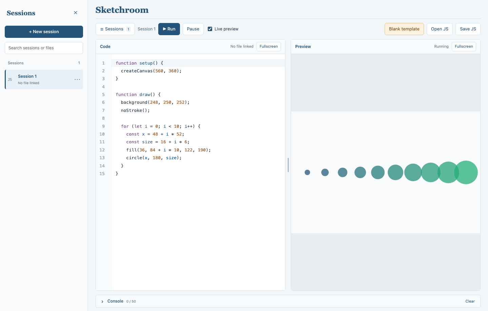

# Sketchroom

A little p5.js workspace: write code on the left, see it on the right.

This started as a teaching tool for tutoring an art student to learn JavaScript. You can open it, try an idea, and save your sketch without setting up a project first.



## Try it

[Download the ZIP](https://github.com/AlexZhou0429/Sketchroom/archive/refs/heads/main.zip), unzip it, and open **index.html**. Keep the folder together. It works offline; there's nothing to install.

Chrome or Edge works best if you want to save changes straight back to a local file.

Start typing, or drop in a `.js` file. The preview updates as you edit. Turn off **Live preview** if you'd rather finish typing before running it.

**Save JS** saves your work. For a new sketch, choose a filename and location. For an existing file, allow the browser to write to it. Browsers without direct file access download a copy instead.

## A few things to know

**Sessions** keeps your sketches between visits. You can switch between them, search by name, or rename and delete them from the `⋯` menu. Your session is remembered automatically, but changes to the actual `.js` file still need **Save JS**.

The editor handles brackets and indentation, with red and yellow underlines for errors and warnings. Hover over one to see what's wrong. Drag the middle divider to make either pane wider, or collapse the console for more room.

- **Cmd/Ctrl + Enter** — run
- **Cmd/Ctrl + S** — save
- **Cmd/Ctrl + /** — comment or uncomment
- **Ctrl + Space** — suggestions

**Blank template** clears the current session after asking. It leaves the original file alone.

Sessions belong to this browser and page location. Clearing browser data or moving the app can lose them, so save anything you want to keep. If a linked file goes missing, drop it in again. The browser may also ask you to renew file permissions.

Imported sketches run as JavaScript, so use code you trust. Sketches with images or other local assets may need a local server; dropping in a `.js` file doesn't bring its assets along.

## Working on the code

It's plain HTML, CSS, and JavaScript. Browser dependencies are in `vendor/`; no build step is needed.

For the development checks:

```sh
npm ci
npx playwright install chromium
npm run check
npm test
npm run format:check
```

`app.js` runs the preview, `editor.js` sets up the editor, and `files.js` / `sessions.js` handle saving and sessions. Tests use a temporary browser workspace, not your own files.

## License

The app's code is MIT licensed. Bundled libraries keep their own licenses; see [third-party notices](THIRD_PARTY_NOTICES.md).
